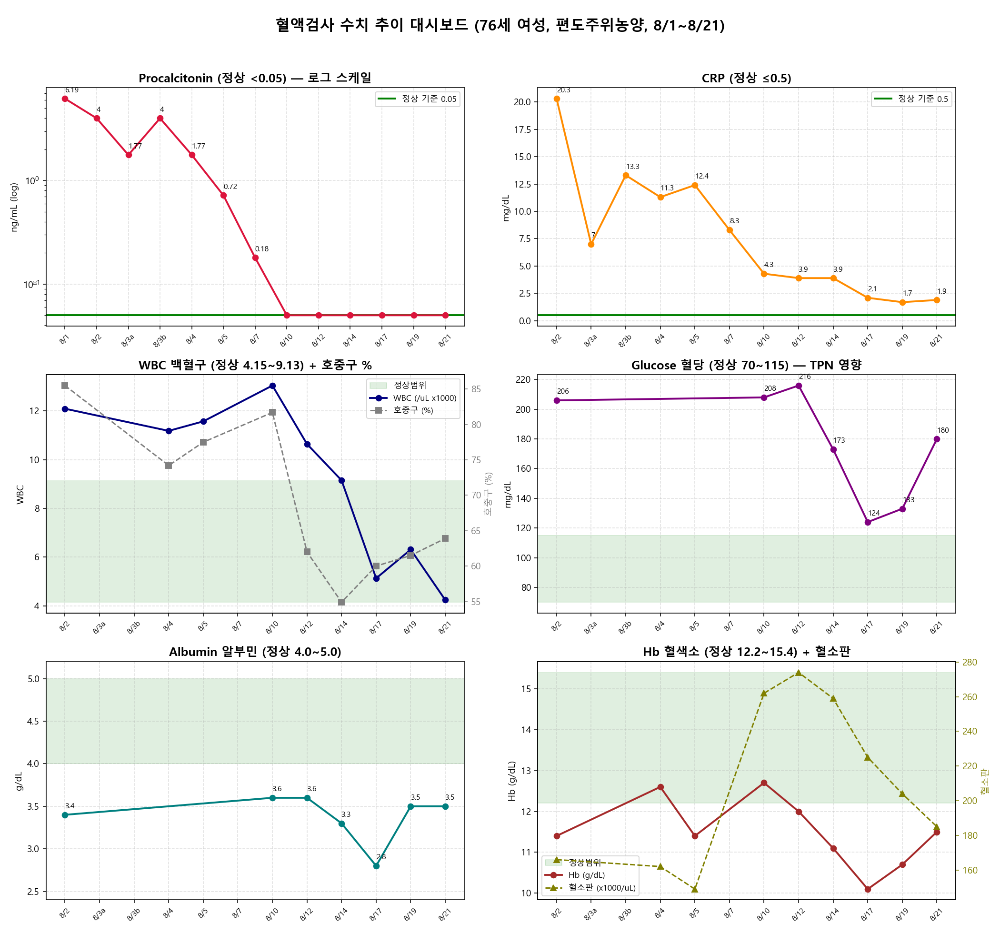

# 편도주위농양 예후 검토 보고서

| 항목 | 내용 |
|---|---|
| **대상 환자** | 76세 여성 (당뇨 · 고혈압 동반) |
| **진단** | 편도선주위농양 (Peritonsillar Abscess) |
| **입원 경과** | 8/1~8/22 입원 · 구강 내 배농 수술 · 매일 배농을 위한 구강 내 처치·소독 · 외부 마사지 및 가글 · 항생제 연고 · 항생제 및 진통제 처방 |
| **데이터 출처** | `C:\Users\Administrator\Desktop\data.csv` (8/1~8/21 검사 수치) |
| **첨부 차트** | `lab_trends_dashboard.png` (본 문서와 같은 폴더, 3부에서 인용) |
| **작성일** | 2026-08-22 (그래프·예측 섹션 추가) |

> **한 줄 요약**: 감염 자체는 매우 잘 호전 중이며, 남은 변수는 **혈당 조절과 잔여 염증**입니다.

---

## 1부. 검사 수치 기반 예후 분석

### 1-1. 감염 지표 추이 — 핵심 근거

#### 프로칼시토닌 (PCT, 중증 세균감염 지표) ✅ 완전 정상화

| 8/1 | 8/2 | 8/3 | 8/5 | 8/7 | 8/10~21 |
|---|---|---|---|---|---|
| **6.19** | 4.0 | 1.77~4.0 | 0.72 | 0.18 | **<0.05 (정상)** |

입원 초기 수치는 패혈증 수준의 전신 감염을 시사할 정도로 높았으나, **배농술 + 항생제 치료에 7~9일 만에 완전히 반응**했습니다. 치료가 병인에 정확히 맞았다는 방증입니다.

#### CRP ⚠️ 90% 이상 감소했으나 아직 미세 잔여

20.3 (8/2) → 13.3 (8/3) → 4.3 (8/10) → 3.9 (8/14) → 1.7 (8/19) → **1.9 (8/21)**

급격한 하강 곡선으로 국소 감염 조절은 성공적입니다. 다만 정상 기준(≤0.5)에 도달하지 않아 **국소 농양** 부위의 잔여 염증이 남아 있는 상태입니다.

> ※ 안내: 원 세션 기록은 이 지점에서 중단되어 일부 후속 서술이 누락되어 있습니다. 누락된 결론은 아래 2부 종합 검토에 반영되어 있습니다.

---

## 2부. 투약 처방 통합 종합 예후 검토

처방 약품명 확인 후 검사 수치 + 투약 내용을 통합해 재정리한 내용입니다.

### 2-1. 현재 투약 구성 분석

| 계열 | 약품 | 성분 | 역할 |
|---|---|---|---|
| **항생제** | 세프트리악손주 2g | Ceftriaxone (3세대 세팔로스포린) | 편도주위농양 1차 표준 항생제 (연쇄상구균+구강 혐기성균 커버) |
| | 홀그램주 600mg | Linezolid (추정, 용량·제형상 일치) | MRSA 등 내성 그람양성균까지 추가 커버 — 중증 감염 대응 |
| **영양** | 오마프플러스원페리주 1448ml | 3챔버 TPN (아미노산+포도당+지방) | **경구 섭취 불가 → 정맥 영양 공급 중** |
| | 엠브이에취(MVH)주 5ml | 종합비타민 (A·D·E·C·B군) | TPN에 첨가되는 비타민 보충 |
| **혈당 조절** | 노보래피드주 + 생리식염수 1000ml | Insulin aspart 지속주입 | TPN·감염 스트레스성 고혈당 관리 |
| **통증·염증** | 뉴아미노펜프리믹스주 | 아세트아미노펜 정맥용 (10mg/ml) | 수술 후 통증·발열 조절 (고령자 안전한 진통제 선택) |
| | 엑소닌정 50mg | 에페리손 (근이완제) | 개구장애(trismus)·경부 근육 긴장 완화 |
| | 디클로메드 0.074% | 디클로페낙 국소제 (패치/겔, 추정) | 외부 마사지 시 사용하는 국소 소염제 |
| **국소 처치** | 탐튬액(가글), 크린조(0.9% 생리식염수 1L) | 구강 소독제·세척용 생리식염수 | 배농 부위 구강 세척·소독 |
| | 네오덱스안연고 | 네오마이신+덱사메타손 안연고 | 항생+항염 연고 |
| **호흉기·위 보호** | 뮤테란주, 뮤코미스트액 | 아세틸시스테인(NAC) | 가래 배출·분비물 관리 (흡인 예방) |
| | 반토록주 40mg | Pantoprazole (PPI, 추정) | 금식·TPN 중 스트레스성 위궤양 예방 |

### 2-2. 투약 내용이 말해주는 임상 상황

이 처방은 단순 항생제 치료가 아니라 **"중증 고위험군 환자의 전신적 케어"**입니다:

1. **TPN 투여 중** = 삼킴 통증으로 경구 섭취가 어려운 상태였다는 의미 → 이것이 **8/17 알부민 2.8로 하락했던 원인**이며, 영양 지원 후 8/21 3.5로 회복한 것과 정확히 맞물립니다 ✅
2. **인슐린 지속주입** = 혈당 변동(206→216→180)을 적극 개입해 조절 중 → 당뇨 환자 감염 회복의 핵심 변수를 관리하고 있음 ✅
3. **리네졸리드 추가** = 초기 배양검사에서 내성균 의심 또는 반응 부족으로 승격한 것으로 보임 → 실제로 PCT는 8/10부터 완전 정상화되어 **약물 조절이 성공적으로 먹힌 것**으로 판단됩니다 ✅

### 2-3. 업데이트된 예후 평가

#### 긍정적 신호 (치료 잘 받고 있음)

- PCT 6.19 → <0.05 완전 정상화, WBC·호중구 정상화, CRP 90%↓
- 영양(TPN)·혈당(인슐린)·통증(다모달 진통)·국소 처치까지 **필요한 모든 축이 커버됨**
- 알부민·혈색소 회복 추세 → 전신 상태 개선 중

#### 예후 결정 변수 (남은 과제)

| 변수 | 현재 상태 | 목표 |
|---|---|---|
| **혈당** | 마지막 180으로 재상승 (TPN 포도당 부하 때문) | 안정화 후 경구 혈당약/기존 인슐린으로 전환 |
| **CRP** | 1.9 (잔여 염증) | 0.5~1 이하 확인 후 항생제 중단·퇴원 논의 |
| **경구 섭취** | TPN 중 | 죽 등 연하 식이 시작 → TPN 서서히 중단 |
| 재발 방지 | — | 문헌상 첫 발작 후 1개월~2년 내 누적 재발률 약 10% (7.4~22%) — 퇴원 후 이비인후과 추적 필수 |

#### 고령자 특이 모니터링 포인트 (의료진에게 확인해볼 사항)

1. **리네졸리드**: 2주 이상 사용 시 혈소판 감소 가능 → CBC 추적 필요 / 혈압 상승 유도 가능(고혈압 환자 주의) / 세로토닌계 약물(항우울제 등) 복용 중이라면 상호작용 확인
2. **세프트리악손 장기 사용**: 담즙 괴질(biliary sludging) 가능성
3. **에페리손**: 어지럼증·기립성 저혈압 → **76세 낙상 주의**
4. **광범위 항생제 장기 투여**: 구간 칸디다(입안 하얀 반점)·C. difficile 설사 관찰
5. 국소 NSAID(디클로메드)는 전신 흡수가 적어 고령·고혈압·당뇨 환자에게 **적절한 선택**입니다 (경구 소염제보다 안전)

### 2-4. 종합 결론

> **예후: 양호 (guardedly good)** — 입원 초기(PCT 6.19)는 패혈증 위험 수준의 중증 감염이었으나, 배농술 + 2중 항생제 + 정맥영양 + 인슐린 집중 관리로 감염 지표가 거의 정상화됐습니다. 남은 관문은 **①혈당 안정화 ②CRP 정상화 ③경구 섭취 재개(TPN 이탈)** 세 가지이며, 이것들이 풀리면 퇴원이 현실적인 시점입니다. 퇴원 후에는 혈당 관리와 이비인후과 외래 추적(재발률 ~10%)이 핵심입니다.

---

## 3부. 혈액검사 수치 그래프 (data.csv 기반)



*그림: 8/1~8/21 주요 지표 추이. 초록 음영 = 정상범위. 좌상 PCT(로그 스케일) / 우상 CRP / 중좌 WBC+호중구% / 중우 혈당 / 하좌 알부민 / 하우 Hb+혈소판*

### 3-1. 그래프에서 읽히는 핵심 포인트

- **PCT (로그 스케일)**: 6.19 → <0.05까지 뚜렷한 일관 감소. 8/10 이후 12일 연속 정상 유지. (8/3 표기상 재상승 1.77→4는 같은 날 두 번 채혈건의 변동이며 직후 다시 하강)
- **CRP**: 8/2~8/5 고원기(11~20) → 8/7부터 급락 → 최근 1주 **1.7~2.1 정체 구간**. 정상(≤0.5)까지 마지막 고개
- **WBC·호중구%**: WBC 13.04(8/10, 치료 반응 지연 구간) → 5.13(8/17) 급정상화. 호중구% 85.5→63.9 정상 복귀, 림프구% 8.3→25.9 면역 회복 신호
- **혈당**: TPN 부하로 206→216 → 인슐린 강화로 124~133까지 조절 성공 → **8/21 180 재상승** (가장 요동치는 지표)
- **알부민**: 8/17 2.8 저점(염증 소모 + 영양 불균형) → TPN 안정화 후 **3.5로 빠른 V자 반등**
- **Hb·혈소판**: Hb 10.1(8/17) 저점 → 11.5 회복. 혈소판은 감염 반응성 증가(274) 후 185로 정상 범위 내 복귀 진행

---

## 4부. 추이 기반 상황 예측

### 4-1. 지표별 단기 전망 (1~2주)

| 지표 | 현재 | 전망 | 재악화 경보 기준 |
|---|---|---|---|
| PCT | <0.05 (12일 연속) | 정상 유지 가능성 높음 — 전신 감염 종결 국면 | >0.5 재상승 시 전신 감염 재평가 |
| CRP | 1.7~1.9 정체 | 배농 처치 지속 시 **2주 내 1.0 이하 완만 하락** 예상 (반감기 ~19시간, 잔여 국소 자극 존재) | >4 반등 시 농양 재발·신규 병소 영상 확인 필요 |
| WBC·호중구 | 정상화 (4.24 / 63.9%) | 정상 유지 전망 | WBC>10 + 호중구% 동반 재상승 시 재감염 의심 |
| 혈당 | 180 (재상승) | **TPN 지속되는 한 변동 예상** → 연하식 시작·TPN 감량과 함께 안정화 | >250 지속 또는 <70 저혈당 발생 시 즉시 조정 |
| 알부민 | 3.5 (회복 중) | TPN 유지 시 1~2주 내 4.0 접근 전망 | 재하락 시 영양 계획 재조정 |
| Hb·혈소판 | 11.5 / 185 | Hb 12 근처 안정화, 혈소판 정상 복귀 진행 | 리네졸리드 2주 초과 사용 시 혈소판 추가 감소 주의 |

### 4-2. 시나리오 예측

**🟢 기본 시나리오 (가장 유력)**
1. 배농 처치·가글 지속 + 현 항생제 유지 → CRP 서서히 1 미만으로
2. 연하식(죽 등) 재개 → TPN 단계적 감량 → 혈당 변동 폭 축소
3. **CRP <1.0 + 경구 섭취 안정 확인 시점(여유 있으면 약 1주 내외)에 항생제 step-down 및 퇴원 논의 가능**

**🔵 긍정 변수**
- PCT 12일 연속 정상 = 합병증 없이 퇴원까지 갈 수 있는 확률을 크게 높이는 근거
- 알부민·Hb 동시 반등(8/17 저점 탈출) = 전신 회복 속도 양호
- 호중구%·림프구% 정상 복귀 = 면역 기능 회복

**🟡 주의 시나리오 (모니터링 필요)**
- TPN 부하로 인한 혈당 재변동 반복 (8/21 180 사례) → 노보래피드 용량 조정 계속 필요
- CRP 1.7~1.9 정체가 **2주 이상 지속**되면 잔여 농양·심부 농양 여부를 CT 등으로 확인 고려
- 고령+당뇨 → 구강 칸디다, C. difficile 설사, 에페리손 관련 낙상 등 합병증 상시 관찰

### 4-3. 퇴원 판단의 마지막 관문 4가지

1. **CRP ≤1.0 확인** — 국소 염증 소멸
2. **경구 식이 시작 후 혈당 안정화** — 경구 혈당약/기존 인슐린으로 전환 완료
3. **TPN 중단 가능** — 경구 섭취 충분해짐
4. **통증·개구장애 호전** — 일반 식이 및 일상 활동 가능

→ 4가지 충족 시 퇴원 현실화. 퇴원 후 이비인후과 외래 추적 필수 (재발률 ~10%)

---

## 5부. 투약 경과 및 현재 상황

### 5-1. 치료 타임라인 (수치와 연동)

```text
8/1     입원 · PCT 6.19 (패혈증 위험 수준)
        └─▶ 구강내 배농 수술 + 세프트리악손 시작
8/2~5   고원기: CRP 20.3→12.4 · WBC 11~12 · 혈당 206
        └─▶ 홀그램(리네졸리드) 추가(추정) · TPN + 노보래피드 인슐린 지속주입 개시
8/7~10  PCT 0.18→<0.05 급락 · CRP 8.3→4.3
        └─▶ 전신 감염 제어 성공 국면 진입
8/12~14 CRP 3.9 정체 · 알부민/Hb 서서히 하락
        └─▶ 염증 소모기: 영양·혈당 집중관리 필요 구간
8/17    알부민 2.8 · Hb 10.1 저점 ↔ WBC 5.13 정상화 · 혈당 124
        └─▶ 가장 취약했던 날 = 반등 전환점
8/19~21 알부민 3.5 반등 · Hb 11.5 · CRP 1.7~1.9 · 혈당 180
        └─▶ 회복 궤도. 남은 과제: 혈당 안정화 + CRP 정상화
```

### 5-2. 약군별 현재 상태와 조정 방향 (예측)

| 약군 | 현재 상황 평가 | 향후 방향 예측 |
|---|---|---|
| 세프트리악손 + 홀그램(리네졸리드) | 감염 지표 정상화를 이끈 유효 조합 입증 | CRP <1.0 확인 후 단계적 축소 검토. **홀그램이 우선 종결 대상**(2주 초과 시 혈소판 감소 위험, 현재 혈소판 185로 여유 축소) |
| 오마프플러스 TPN + MVH 비타민 | 경구 섭취 불가 기간의 생명줄, 알부민 V자 반등에 기여 | 연하식 시작 즉시 감량 개시 → 중단 목표. 중단 초기 혈당 변동 주의 |
| 노보래피드(인슐린 aspart) 지속주입 | 124~216 요동을 실시간 제어 중 | TPN 감량 속도에 맞춰 용량 축소 → 경구 혈당약/평소 인슐린 regimen으로 복귀 |
| 뉴아미노펜(정맥 진통제) + 엑소닌(에페리손) | 수술 후 통증·개구장애 관리 담당 | 통증 호전 순서대로 순차 중단 예상. 에페리손은 낙상 주의하며 최단기 유지 |
| 탐튬 가글 · 크린조 세척 · 네오덱스 연고 | 잔여 CRP 1.7~1.9를 깎는 국소 치료의 핵심 | CRP 정상화 후에도 재발 방지 위해 구강 위생 처치 당분간 유지 권장 |
| 뮤테란·뮤코미스트(NAC), 반토록(PPI) | 흡인 예방 · 스트레스성 위궤양 예방 | 경구 섭취·식이 정상화되면 반토록부터 우선 중단 검토 |

> ※ 위 "향후 방향 예측"은 수치 추이 기반 참고 정보이며, 실제 조정은 반드시 담당 의료진 판단을 따릅니다.

---

⚠️ **면책 고지**: 본 문서는 제공된 데이터 기반의 참고 정보이며, 실제 치료 방향·투약 조정은 반드시 담당 의료진의 판단을 따르셔야 합니다.
